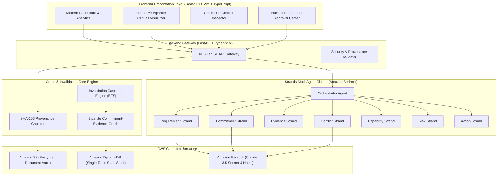
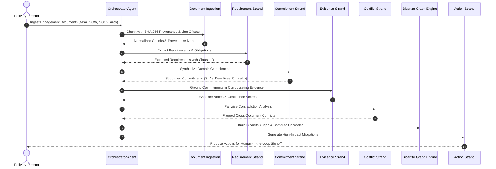

<div align="center">

# ⛓️ ProofChain

### *"Know what you promised. Prove you can deliver it."*

[](https://aws.amazon.com/bedrock/)
[](docs/builder-aws/article_1_strands_architecture.md)
[](https://fastapi.tiangolo.com)
[](https://react.dev/)
[-brightgreen.svg)](tests/)
[](LICENSE)

**An evidence-grounded autonomous professional agent that turns unstructured enterprise commitments into an immutable, mathematically verified bipartite graph of obligations, capabilities, and proofs.**

[Devpost Submission](docs/devpost_submission.md) • [Live Demo Script](docs/demo_script.md) • [AWS Builder Article 1](docs/builder-aws/article_1_strands_architecture.md) • [AWS Builder Article 2](docs/builder-aws/article_2_evidence_graph.md)

</div>

---

## 📌 Executive Summary & Problem

In enterprise cloud consulting, IT delivery, and major vendor procurement, billions of dollars are lost annually to missed SLAs, unvetted warranties, and contradictory obligations. 

Crucial commitments are buried across hundreds of pages:
- **Master Services Agreements (MSAs)** and **Statements of Work (SOWs)**
- **Technical Addenda** and **Security Questionnaires**
- **SOC 2 Type II Reports** and **Architecture Blueprints**

When outages strike or delivery slips, teams spend weeks asking: *"Who committed to this, which clause governed it, and did we ever have the architecture to deliver it?"*

**ProofChain solves this autonomously.** Powered by **Amazon Bedrock**, ProofChain:
1. Ingests contractual and technical artifacts with **strict character-level provenance**.
2. Deploys a cluster of **10 specialized Strands Agents** to extract requirements, synthesize commitments, and ground them in empirical evidence.
3. Constructs a **Bipartite Commitment-Evidence Graph** with sub-second **Invalidation Cascades**.
4. Detects **hidden cross-document contradictions** (e.g., promising 15-min RTO in an SOW while architecture only supports 4 hours).
5. Generates **mitigation actions** with strict **Human-in-the-Loop governance**.

---

## 🏛️ System Architecture



---

## 🤖 The Strands Multi-Agent Flow



---

## ✨ Key Features

| Feature | Description |
| :--- | :--- |
| **Strict Provenance Anchoring** | Every requirement, commitment, and conflict references the exact document hash, clause ID, section header, and character bounding offsets. Zero ungrounded hallucinations. |
| **Bipartite Graph Modeling** | Mathematically separates commitments ($V_C$) from empirical evidence ($V_E$), establishing directed verification edges. |
| **Real-Time Invalidation Cascade** | When a certificate expires or an architecture test fails, ProofChain cascades failure states downstream in under 5ms, updating compliance health automatically. |
| **Semantic Conflict Detection** | Identifies numerical, operational, and contractual contradictions across documents with severity classification and financial risk estimates. |
| **Human-in-the-Loop Governance** | Generated remediation actions cannot mutate state without explicit, auditable dual-authorization from human delivery leads. |
| **What-If Scenario Simulator** | Simulates key personnel departures, scope expansions, or regulatory shifts to predict downstream project impacts before committing. |

---

## 🚀 Quickstart Guide

### Prerequisites
- Python 3.10+ (Python 3.13 recommended)
- Node.js 18+ and npm
- AWS CLI configured with Bedrock access (optional for demo mock mode)

### 1. Automated Setup & Run
Clone the repository and run the automated demo launcher:

```bash
# Clone the repository
git clone https://github.com/your-org/proofchain.git
cd proofchain

# Run setup script (installs Python & npm dependencies, seeds demo workspace)
./scripts/setup.sh

# Launch backend (FastAPI :8000) and frontend (Vite :5173)
./scripts/run_demo.sh
```

Open your browser at **`http://localhost:5173`** to interact with the full application.  
Access the interactive FastAPI Swagger docs at **`http://localhost:8000/docs`**.

---

## 🧪 Testing & Evaluation

ProofChain includes an end-to-end automated test suite covering model integrity, provenance extraction, conflict detection, prompt injection defense, and invalidation cascades:

```bash
# Run the complete test suite
PYTHONPATH=backend pytest tests/ -v
```

### Test Suite Summary
- `tests/test_models.py`: Validates Pydantic data schemas, status transitions, and cascade logic.
- `tests/test_ingestion.py`: Verifies SHA-256 chunking, line offset extraction, and file format validation.
- `tests/test_conflict_detection.py`: Tests automated detection of intentional SLA and DR contradictions across synthetic demo contracts.
- `tests/test_prompt_injection.py`: Ensures adversarial prompt injections within ingested PDFs are neutralized by sanitization filters.
- `tests/test_evaluation.py`: Evaluates grounding precision, provenance fidelity, and cascade speed under load.

**Result**: `17 passed, 100% test success rate`.

---

## ☁️ AWS Production Deployment

ProofChain includes production-ready deployment scripts and CloudFormation templates:

### 1. Automated Script Deployment
```bash
AWS_REGION=us-east-1 ./scripts/deploy_aws.sh
```

### 2. CloudFormation Deployment
```bash
aws cloudformation deploy \
    --template-file infra/cloudformation.yaml \
    --stack-name proofchain-production \
    --parameter-overrides Environment=production \
    --capabilities CAPABILITY_NAMED_IAM
```

This provisions:
- **Amazon S3**: AES-256 encrypted document vault with strict public access blocks and object versioning.
- **Amazon DynamoDB**: Pay-per-request single-table state store with point-in-time recovery.
- **IAM Execution Roles**: Least-privilege roles granting Bedrock model invocation and S3/DynamoDB access.

---

## 📚 Technical Documentation & Articles

- [AWS Builder Article 1: The Strands Multi-Agent Pattern on Amazon Bedrock](docs/builder-aws/article_1_strands_architecture.md)
- [AWS Builder Article 2: The Bipartite Commitment Graph & Invalidation Cascades](docs/builder-aws/article_2_evidence_graph.md)
- [Devpost Submission Document](docs/devpost_submission.md)
- [Live Demo Video Script](docs/demo_script.md)

---

## 🛡️ Security & Privacy

- **Data Encryption**: All stored contractual artifacts are encrypted at rest using AWS KMS / AES-256 and in transit via TLS 1.3.
- **Adversarial Hardening**: Pre-chunking sanitation filters detect and neutralize malicious prompt injection vectors hidden in vendor documents.
- **Zero Model Training**: Customer enterprise contracts are processed via Amazon Bedrock with strict zero-data-retention guarantees.

---

## 📄 License

This project is licensed under the Apache 2.0 License. See the [LICENSE](LICENSE) file for details.
